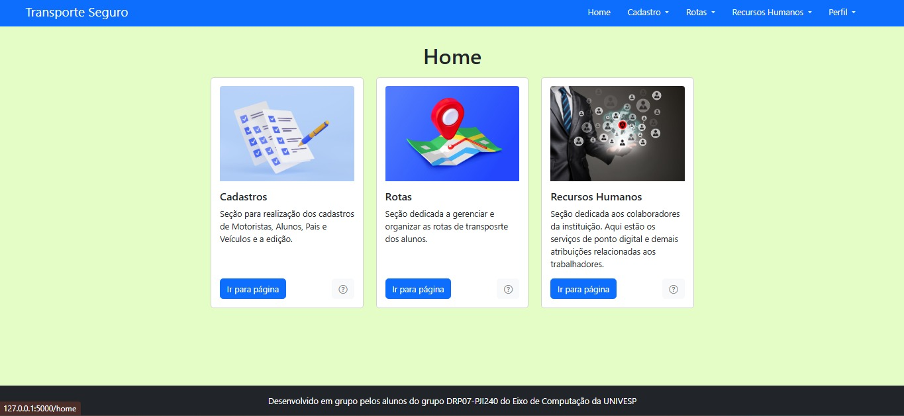
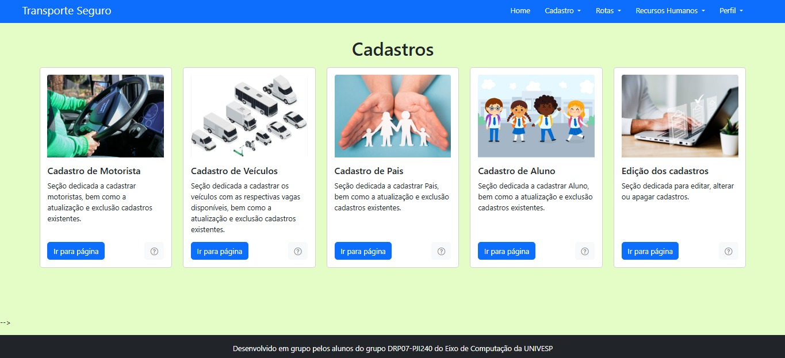
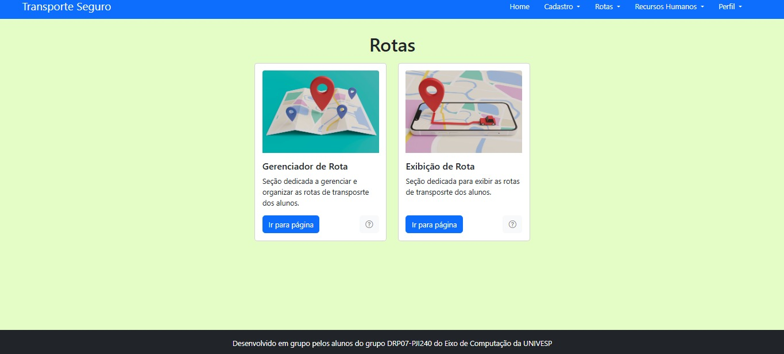
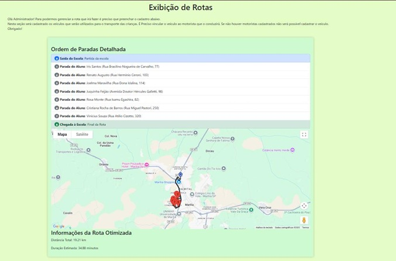

# Transporte Seguro

##  Sobre o Projeto

O **Transporte Seguro** é uma aplicação web desenvolvida para otimizar e gerenciar o transporte escolar de alunos. A solução auxilia a escola no controle e na elaboração de rotas eficientes, ao mesmo tempo em que proporciona maior transparência para os pais, permitindo que acompanhem o itinerário do transporte de seus filhos.

##  Demonstração da Interface

Aqui você pode visualizar as principais telas do aplicativo, como a tela principal, os formulários de cadastro e a visualização das rotas no mapa:

  

 

| Cadastros | Rotas  | Rotas Geradas |
| :---: | :---: | :---: |
|  |  | |

###  Problema & Solução
Para resolver os desafios de organização, controle de vagas e planejamento logístico no transporte escolar, o sistema oferece:
- **Autenticação segura:** Cadastro de usuários com verificação de conta via e-mail.
- **Gestão de atores e veículos:** Cadastro de alunos, responsáveis, motoristas e veículos.
- **Controle de capacidade:** Vinculação de motoristas aos veículos com controle de vagas disponíveis, e alocação dos alunos de acordo com a capacidade.
- **Roteamento inteligente:** Integração com APIs de mapas para geração automática de rotas com base nos endereços cadastrados.
- **Segurança e Criptografia:** Armazenamento seguro de senhas utilizando algoritmos de criptografia em Hash.
-  **Recuperação de Acesso:** Sistema de redefinição de senha via envio de token temporário por e-mail.
-  **Validação de Usuários:** Fluxo de cadastro com confirmação de conta por e-mail para liberação de acesso.

---

##  Funcionalidades Principais

-  **Geração de Rotas Automáticas:** Criação de itinerários otimizados utilizando os endereços dos alunos vinculados a cada transporte.
-  **Validação de Usuários:** Fluxo de cadastro com envio e confirmação de token por e-mail para liberação de acesso.
-  **Busca de Endereços:** Preenchimento e validação simplificada de endereços via CEP.
-  **Gestão de Vagas e Alocações:** Mapeamento em tempo real do limite de passageiros por veículo e condutor.
- 🔌 **API RESTful:** Comunicação entre frontend e backend padronizada via requisições JSON.

---

##  Tecnologias Utilizadas

### **Backend & Banco de Dados**
- **Python** (Linguagem base)
- **Flask** (Framework web e construção das rotas REST)
- **PostgreSQL** (Banco de dados relacional para persistência de dados)
- **Criptografia / Hashing** (Segurança para armazenamento de senhas e geração de tokens de recuperação)

### **Frontend**
- **HTML5 & CSS3** (Estruturação e estilização das páginas)
- **Bootstrap** (Framework para design responsivo e componentes de interface)
- **JavaScript (ES6+)** (Manipulação de DOM, tratamento de dados e requisições assíncronas via JSON)

### **APIs & Serviços Externos**
- **Google Maps API** (Cálculo e exibição de rotas)
- **ViaCEP API** (Autocompletar e validação de endereços por CEP)
- **Serviço de E-mail** (Envio de e-mails para validação de cadastro)
